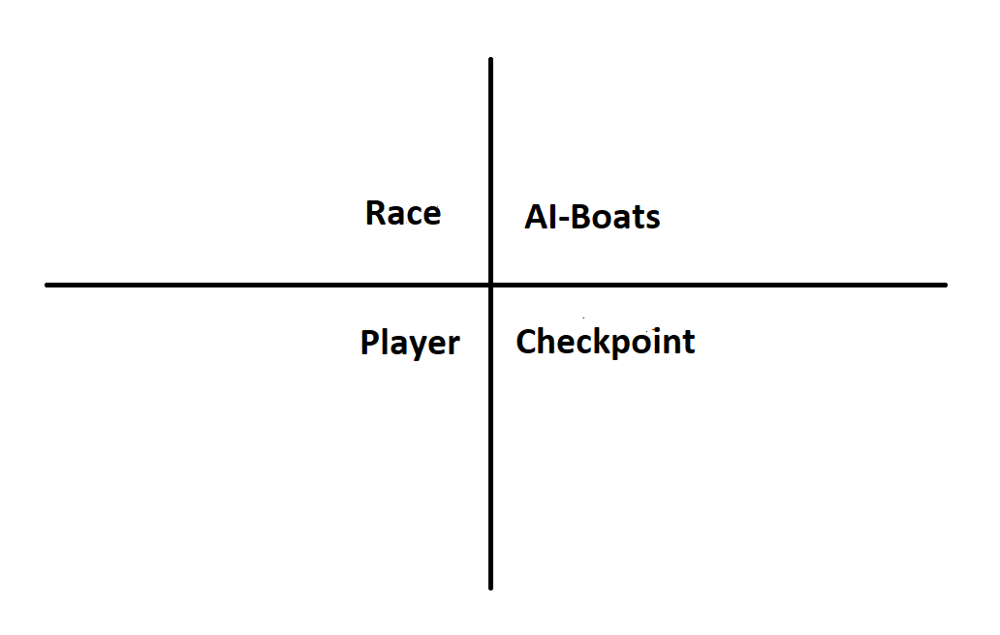

# VR Speedboat Racing Game

## Groepsleden

| Naam | S-nummer |
| :---: | :---: |
| Mohamed Azdad | s106961 |
| Abdelmajid Amiri | s109434 |
| Mirwahaj Waez | s107602 |
| Nabil El Moussaoui | s109431 |
| Udaya Sharma | s118202 |

## Inleiding

Voor het vak VR Experience hebben we ervoor gekozen om een speed boat racing game te ontwikkelen in VR met behulp van Unity. Het is de bedoeling dat je een sprint gaat afleggen. Een sprint is een soort circuit dat geen laps bevat, waarbij je van de start naar de finishline moet geraken. In deze race is de bedoeling dat je eerst geraakt tegen de AI getrainde boten.

## Samenvatting

We geven hier stap voor stap de uitleg hoe we van een lege Unity project onze project kan reconstrueren. Verder geven we hieronder meer uitleg over de installatie, objecten, scripts, assets en methoden dat we gebruiken.

## Methoden

### Installatie

We hebben deze installaties nodig om het project te vervolledigen:
- Unity: 2020.3.18f1
- ML-Agents 2.0.0
- Anaconda 2021.11
- Python 3.9.7 64-bit
- PyTorch 1.10.0

### Verloop van het spel

Om het spel te starten moet er eerst op het "Start het Spel' knop gedrukt worden. Vervolgens start het spel en vertrekken de AI-Boten. Het is nu de bedoeling om één per één de AI Boten in te halen. Om dit te kunnen doen moet de speler een peddel gebruiken. Om vooruit te gaan moet de speler beiden kanten roeien. Als de spelen aan de zelfde kant roeit zal de boot beginnen draaien naar de omgekerde kant. Om naar rechts te kunnen gaan moet men links roeien en om naar links te kunnen gaan moet men rechts roeien. Als de speler einddoel bereikt wordt er de resultaten getoond. Er zijn verschillende soorten AI-Boaten. Sommige zijn makkelijker te overwinnen en andere moeilijker.

Hieronder kan je zien hoe de speler de peddel kan gebruiken om te bewegen.


*figuur1*

De parcour dat we gaan gebruiken is een sprint waarvan we vanuit de start rechtstreeks naar de finish roeien. De checkpoints worden gebruikt om de Boot-AI te laten trainen.

\
*figuur2*

### Duidelijk overzicht van de observaties, mogelijke acties en beloningen

#### Obeservaties

Voor observaties worden er Rayperception sensor componenten gebruikt. Zo kunnen de Ai-boaten hun omgeving en obstakels observeren. Er worden 5 rays per directie gebruikt om te obeserveren. Omdat de boten ook andere boten kunnen raken is de gebruikt gemaakt van 150 graden ray. Ray lengte is ingesteld op 105 zodat de boten op de checkpoint kunnen stralen.


#### Acties

Na observeren, moet de agent een actie uitvoeren. Er zijn vier acties mogelijk, voorbewegen, stilstaan, links en recht draaien . De AI-Boat moet aan de hand van obervatie de nodige actie uitvoeren. Als er een ray wordt gecast naar een terrein, moet de Ai-boat dit proberen te vermijden.

#### Beloningen

De beloning wordt gegeven na een bepaalde actie die door de AI-boat is uitgevoerd. De actie die de AI-boat dichter bij het doelpunt brengt, wordt beloond met bonuspunten en aan de andere kant wordt de boat bestraft als de actie dat niet doet.

In dit spel worden de AI-boten beloond met +1.0 waarde als ze de checkpoint behalen en de einddoel bereiken. Ze worden ook beloond als ze gwn voortbewegen met 0.01.
Als de Ai-boten het terrein raken worden ze bestraft met -1.0. Als ze links en recht draaien worden ze ook bestraft met -0.01. Dit is om de rotatie te voorkomen. Om botsing tussen de boten te voorkomen wordt er ook met -0.01 bestraft.

### Beschrijving van de objecten en de gedragingen van de objecten

```
WhiteBeardScene
    Boat_1
    EnvironmentRechtdoor
        TerrainRechtdoor
        CheckpointTrainingRechtdoor
            Checkpoint (1)
            Checkpoint (2)
            ...
        WaterBasicDaytime
        BOAT_PARENT_AI
    EnvironmentRechtsBocht
        TerrainRechtsBocht
        CheckpointTrainingRechtsBocht
            Checkpoint (1)
            Checkpoint (2)
            ...
        WaterBasicDaytime
        BOAT_PARENT_AI
    EnvironmentLinksBocht
        TerrainLinksBocht
        CheckpointTrainingLinksBocht
            Checkpoint (1)
            Checkpoint (2)
            ...
        WaterBasicDaytime
        BOAT_PARENT_AI
```

\
*figuur3*

Boat_1 = Speler
De environments 'Rechtdoor', 'LinksBocht' en 'RechtsBocht' zijn onze chunks environments waar we onze Boot-AI's makkelijker kunnen laten trainen, zodat we die later in onze Sprint parcour gaan implementeren.

Elk environment bevat een Boot-AI, een terrein, water en enkele checkpoints waar de Boot-AI's punten krijgen als men erdoor gaat.

Voor het terrein hebben we een tag gebruikt om de collision van onze Boot-AI te ondervinden. Hetzelfde principe wordt ook toegepast voor onze Boat_1.
De checkpoints hebben we een tag aan toegekent dat we daarop een positieve reward krijgen.

In verband met de implementatie van het water en de boten hebben we een script gebruikt zodat we het effect krijgen dat de boot drijft.

## Scripts

Referentie naar onze scripts vinden jullie hier terecht:\
[BoatAgent.cs](VR_WhiteBeard/Assets/Scripts/BoatAgent.cs) \
[BoatAi.cs](VR_WhiteBeard/Assets/Scripts/BoatAi.cs) \
[DebugCheckpointRay.cs](VR_WhiteBeard/Assets/Scripts/DebugCheckpointRay.cs) \
[Engine.cs](VR_WhiteBeard/Assets/Scripts/Engine.cs) \
[Floater.cs](VR_WhiteBeard/Assets/Scripts/Floater.cs) \
[Paddle.cs](VR_WhiteBeard/Assets/Scripts/Paddle.cs) \
[WaterManager.cs](VR_WhiteBeard/Assets/Scripts/WaterManager.cs) \
[WaveManager.cs](VR_WhiteBeard/Assets/Scripts/WaveManager.cs)


### One Pager

#### Inleiding van het spel

We hebben ervoor gekozen om een speed boat racing game te ontwikkelen in VR. Via een menu ga je het spel kunnen starten. Dan zal het spel beginnen. Je zal dan moeten racen tegen andere boten (AI gestuurd). 

#### AI gestuurde boten

Het AI gedeelte zal dan de boten zijn dat tegen jou racen. Zij moeten dus de route leren en ervoor zorgen dat ze niet tegen elkaar botsen of tegen jou. Onderweg zou er dan ook de mogelijkheid zijn om punten te winnen. Dat moeten ze ook leren vangen. 

#### Interactie met het spel

In het begin zal je met je controller naar het start knop moeten wijzen om het spel te starten. Als je in de boot zit zal je hem kunnen besturen via het stuur. Het stuur zal grabbable zijn door twee handen en kan dus draaien naar links en rechts.

#### Draaiboek

- Wie ben jij in de VR Controller? Boat Player
- Wie zijn de agent/agents? Boat AI
- Hoe zit het parcour eruit? Sprint [*figuur2*](Afbeeldingen/01_SprintParcour.png)

#### Kwadrant
\


## Resultaten
### Resultaten van de training met Tensorboard afbeeldingen
### Beschrijving van de Tensorboard grafieken
### Opvallende waarnemingen tijdens het trainen 

Abdelmajid:

\
*figuur4*

\
*figuur5*

Nabil:

\
*figuur6*

Dit is de training op het grote terein
Voor de komende testen hebben we besloten om 3 terreinen te construeren en die dan te laten trainen.

### Een 'persoonlijke' visie op de resultaten, wat betekenen de resultaten nu eigenlijk

In het begin raakt de Boot-AI het terrein aan de kanten waarvan ze strafpunten krijgen. Zo leert die op het einde dat die door elke checkpoint moet gaan om een beloning te krijgen.

## Conclusie

### Samengevat wat we gedaan hebben

We hebben voor dit vak een Boat Racing spel gemaakt en het is voltooid met veel complicaties. Het VR-gedeelte was niet zo moeilijk, maar het trainen van een AI om te racen was erg ingewikkeld. We hebben de AI een aantal keer moeten trainen om het gewenste resultaat te krijgen. De AI-boten hebben verschillende uitdagingen. De AI-boten werden met verschillende parameters getraind om telkens een ander resultaat te krijgen. Door dit te doen, had de speler de ervaring van een echte race. Sommige zijn makkelijk en sommige zijn erg moeilijk te winnen. Door dit te doen, werd onze spel interactief en leuk om te spelen.

### Kort overzicht resultaten

We hebben de gewenste eindresultaat behaald. Speler kan met Vr bril zelf varen en de uitdaging aangaan.

### Verbeteringen naar de toekomst toe

We zijn wat laat begonnen met training van AI. We hadden veel complicaties met training. In de toekomst zouden we beter eerst beginnne met AI-gedeelte.

## Bronvermelding

Boat Controller - Unity Ocean Tutorial 4/4. (2019, 9 maart). YouTube. Geraadpleegd op 9 januari 2022, van https://www.youtube.com/watch?v=gdW_rXFE1Gk

ML-Agents 1.0+ Creating a Mario Kart like AI. (2020, 15 november). YouTube. Geraadpleegd op 9 januari 2022, van https://www.youtube.com/watch?v=n5rY9ffqryU
