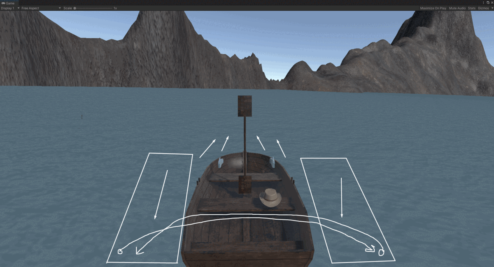
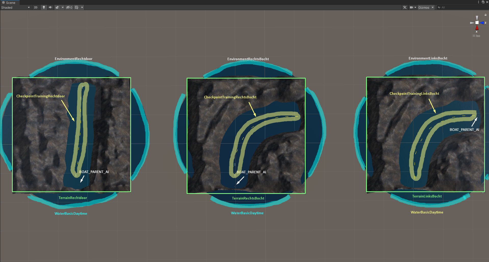
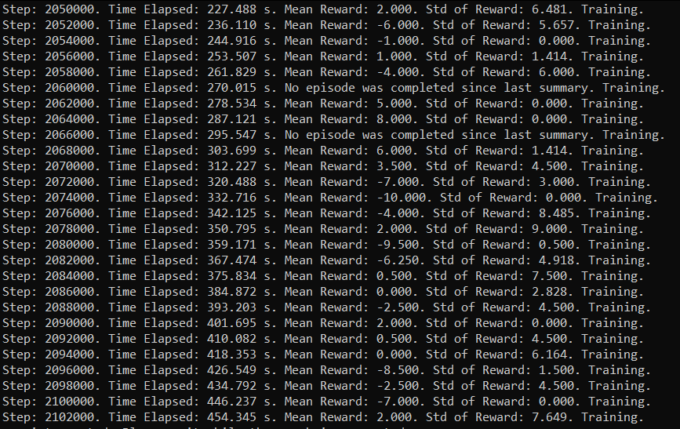
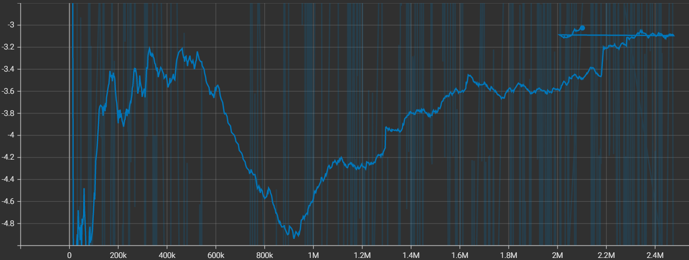
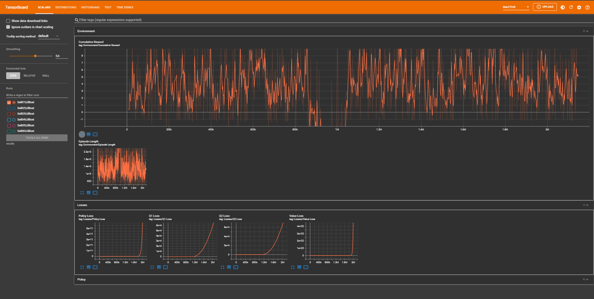

# VR Speedboat Racing Game

## Groepsleden

| Naam | S-nummer |
| :---: | :---: |
| Mohamed Azdad | s106961 |
| Abdelmajid Amiri | s109434 |
| Mirwahaj Waez | s107602 |
| Nabil El Moussaoui | s109431 |
| Udaya Sharma | s118202 |

## Inleiding

Voor het vak VR Experience hebben we ervoor gekozen om een speed boat racing game te ontwikkelen in VR met behulp van Unity. Het is de bedoeling dat je een sprint gaat afleggen. Een sprint is een soort circuit dat geen laps bevat, waarbij je van de start naar de finishline moet geraken. In deze race is de bedoeling dat je eerst geraakt tegen de AI getrainde boten.

## Samenvatting

We geven hier stap voor stap de uitleg hoe we van een lege Unity project onze project kan reconstrueren. Verder geven we hieronder meer uitleg over de installatie, objecten, scripts, assets en methoden dat we gebruiken.

## Methoden

### Installatie

We hebben deze installaties nodig om het project te vervolledigen:
- Unity: 2020.3.18f1
- ML-Agents 2.0.0
- Anaconda 2021.11
- Python 3.9.7 64-bit
- PyTorch 1.10.0

### Verloop van het spel

Om het spel te starten moet er eerst op "Start het Spel' knop drukken. Vervolgens start het spel en vertrekken de AI-Boten. Het is nu de bedoeling om één per één de AI Boten in te halen. Om dit te kunnen doen moet een speler met een Paddle roeien om te kunnen bewegen, maar als men naar voor moet gaan roeien moet de speler afwisselend naar rechts en links roeien. Om naar rechts te kunnen gaan moet men links roeien en om naar links te kunnen gaan moet men rechts roeien.


*figuur1*

De parcour dat we gaan gebruiken is een sprint waarvan we vanuit de start rechtstreeks naar de finish roeien. De checkpoints worden gebruikt om de Boot-AI te laten trainen.

\
*figuur2*

### Duidelijk overzicht van de observaties, mogelijke acties en beloningen (Nog niet klaar --Udaya take the wheel)


### Beschrijving van de objecten en de gedragingen van de objecten

```
WhiteBeardScene
    Boat_1
    EnvironmentRechtdoor
        TerrainRechtdoor
        CheckpointTrainingRechtdoor
            Checkpoint (1)
            Checkpoint (2)
            ...
        WaterBasicDaytime
        BOAT_PARENT_AI
    EnvironmentRechtsBocht
        TerrainRechtsBocht
        CheckpointTrainingRechtsBocht
            Checkpoint (1)
            Checkpoint (2)
            ...
        WaterBasicDaytime
        BOAT_PARENT_AI
    EnvironmentLinksBocht
        TerrainLinksBocht
        CheckpointTrainingLinksBocht
            Checkpoint (1)
            Checkpoint (2)
            ...
        WaterBasicDaytime
        BOAT_PARENT_AI
```

\
*figuur3*

Boat_1 = Speler
De environments 'Rechtdoor', 'LinksBocht' en 'RechtsBocht' zijn onze chunks environments waar we onze Boot-AI's makkelijker kunnen laten trainen, zodat we die later in onze Sprint parcour gaan implementeren.

Elk environment bevat een BootAI, een terrein, water en enkele checkpoints waar de Boot-AI's punten krijgen als men erdoor gaat.

Voor het terrein hebben we een tag gebruikt om de collision van onze Boot-AI te ondervinden. Hetzelfde principe wordt ook toegepast voor onze Boat_1.
De checkpoints hebben we een tag aan toegekent dat we daarop een positieve reward krijgen.

In verband met de implementatie van het water en de boten hebben we een script gebruikt zodat we het effect krijgen dat de boot drijft.

## Scripts

Referentie naar onze scripts vinden jullie hier terecht:\
[BoatAgent.cs](VR_WhiteBeard/Assets/Scripts/BoatAgent.cs) \
[BoatAi.cs](VR_WhiteBeard/Assets/Scripts/BoatAi.cs) \
[DebugCheckpointRay.cs](VR_WhiteBeard/Assets/Scripts/DebugCheckpointRay.cs) \
[Engine.cs](VR_WhiteBeard/Assets/Scripts/Engine.cs) \
[Floater.cs](VR_WhiteBeard/Assets/Scripts/Floater.cs) \
[Paddle.cs](VR_WhiteBeard/Assets/Scripts/Paddle.cs) \
[WaterManager.cs](VR_WhiteBeard/Assets/Scripts/WaterManager.cs) \
[WaveManager.cs](VR_WhiteBeard/Assets/Scripts/WaveManager.cs)


### One Pager

#### Inleiding van het spel

We hebben ervoor gekozen om een speed boat racing game te ontwikkelen in VR. Via een menu ga je het spel kunnen starten. Dan zal het spel beginnen. Je zal dan moeten racen tegen andere boten (AI gestuurd). 

#### AI gestuurde boten

Het AI gedeelte zal dan de boten zijn dat tegen jou racen. Zij moeten dus de route leren en ervoor zorgen dat ze niet tegen elkaar botsen of tegen jou. Onderweg zou er dan ook de mogelijkheid zijn om punten te winnen. Dat moeten ze ook leren vangen. 

#### Interactie met het spel

In het begin zal je met je controller naar het start knop moeten wijzen om het spel te starten. Als je in de boot zit zal je hem kunnen besturen via het stuur. Het stuur zal grabbable zijn door twee handen en kan dus draaien naar links en rechts.

#### Draaiboek

- Wie ben jij in de VR Controller? Boat Player
- Wie zijn de agent/agents? Boat AI
- Hoe zit het parcour eruit? Sprint [*figuur2*](Afbeeldingen/01_SprintParcour.png)

#### Kwadrant
[Informatie over Kwadranten](https://www.cuemath.com/geometry/quadrant/)

## Resultaten
### Resultaten van de training met Tensorboard afbeeldingen
### Beschrijving van de Tensorboard grafieken
### Opvallende waarnemingen tijdens het trainen 

Abdelmajid:

\
*figuur4*

\
*figuur5*

Nabil:

\
*figuur6*

Dit is de training op het grote terein
Voor de komende testen hebben we besloten om 3 terreinen te construeren en die dan te laten trainen.

## Conclusie (1 à 3 paragrafen)

### Samengevat wat we gedaan hebben (één zin)
### Kort overzicht resultaten (2 á 3 zinnen zonder cijfers te vernoemen)
### Een 'persoonlijke' visie op de resultaten, wat betekenen de resultaten nu eigenlijk
### Verbeteringen naar de toekomst toe

## Bronvermelding
Je mag eventueel gebruik maken van de instructievideo's van deze cursus of naar de Obelix tutorial. Voor alle ander materiaal waar je gebruik van maakt en dat bestaat uit meer dan één regel aan code, verwijs je naar de oorspronkelijke bron op een gepaste wijze (APA-stijl). Een ontbrekende of incorrecte verwijzing wordt als plagiaat beschouwd.
